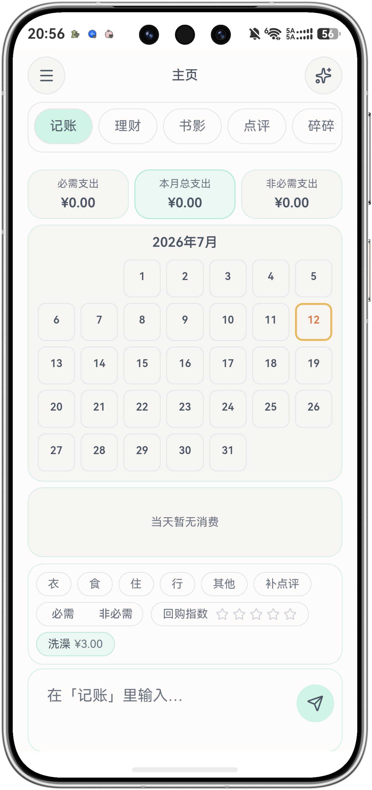
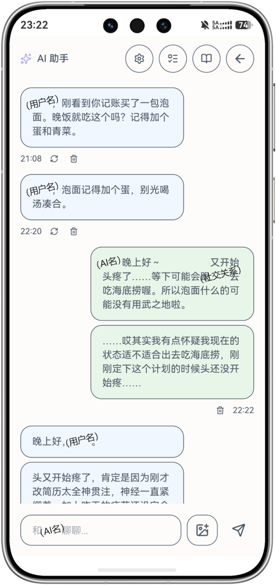
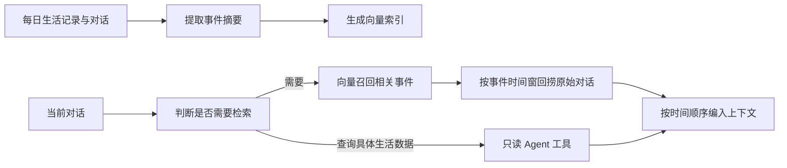

# F-Sync

> 一个由个人生活数据驱动的 AI 生活陪伴原型：让 AI 不只看见当前对话，也能在需要时理解用户的生活记录与历史共同经历。

F-Sync 是我独立设计、并借助 AI Coding 工具持续实现的个人项目。它将记账、书影、点评、碎碎念、工作记录、时间轴等生活信息统一存储，并通过长期记忆检索和只读 Agent 工具，为 AI 角色提供按需、可追溯的上下文。

项目当前为**单用户、自用的可运行原型**，主要用于验证个人数据如何支撑更连续的 AI 陪伴体验，不是面向公众开放注册的成熟产品。

## 界面预览

<p align="center">
  
  
</p>

## 解决的问题

通用聊天产品通常只能依赖有限的当前对话上下文；当历史消息超出窗口，或用户的生活信息散落在不同记录中时，AI 很难正确延续共同经历。F-Sync 尝试解决三个问题：

- **生活信息如何被 AI 理解**：把不同类型的个人记录统一为可查询的数据，而不是每轮把全部信息塞入 Prompt。
- **历史对话如何按需回忆**：先用事件摘要作为索引，再回捞对应时间段的原始对话，降低摘要失真与上下文成本。
- **AI 如何主动参与生活**：结合时间、天气、位置、近期记录与对话间隔，在满足条件时生成主动消息。

## 已实现能力

### 生活记录与跨端使用

- 统一记录记账、点评、碎碎念、工作、收藏、时间轴和书影状态。
- 提供月度支出、碎碎念回显、书影连续点评等查看方式。
- Web 端部署于 Vercel，通过 Supabase 实现认证、数据存储与同步；使用 HarmonyOS WebAbility 封装移动端入口。

### AI 对话与情境上下文

- 支持 OpenAI-compatible API，可配置主对话模型、文本解析模型、Embedding 模型和独立识图模型。
- 在对话上下文中按时间编排当前会话、检索结果及真实世界信息。
- 注入当前时间、天气、位置、距上次对话时间和计时状态，减少跨时段对话被误判为连续情境。
- 支持图片直传或“视觉模型生成摘要 → 主模型回复”两种识图方式。

### 长期记忆与 Agent 查询



- 由模型判断本轮是否需要搜索历史记忆或生活记录，普通闲聊不固定触发检索。
- 使用事件摘要定位相关日期与时间窗，再回捞原始 `user/assistant` 对话并保持角色与时间顺序。
- 生活记录支持向量语义检索、全文匹配和类型／时间等条件过滤。
- 提供只读 Agent 工具，按业务域查询聊天、生活记录、书影、用户画像与理财等数据；工具不开放写入、修改和删除。

## 关键设计取舍

- **按需检索，而非全量注入**：减少无关信息和 Token 消耗。
- **摘要用于定位，原文用于回答**：事件摘要承担低成本索引，最终上下文尽量使用原始对话，降低摘要信息损失。
- **检索结果统一进入时间线**：历史对话、生活记录和工具结果按时间组织，帮助模型理解事件先后关系。
- **工具访问采用业务白名单**：Agent 只能查询已定义的数据域和字段，不接受任意 SQL。

## 技术架构

```text
React 19 + TypeScript + Vite
        ↓
Vercel Serverless Functions
        ↓
Supabase (PostgreSQL / Auth / Realtime / pgvector)
        ↓
OpenAI-compatible AI API

GitHub Actions → 定时摘要 / 主动消息
HarmonyOS WebAbility → 移动端 WebView 与原生推送
```

主要技术：React、TypeScript、Vite、TailwindCSS、Zustand、Supabase、pgvector、Vercel Serverless Functions、GitHub Actions、HarmonyOS Push Kit。

## 项目边界

- 这是个人探索项目，目前只有开发者本人长期使用，尚未进行规模化用户验证。
- 需求分析、产品流程、Prompt／Context 策略、验收与迭代由我完成；主要代码通过 Codex、Claude Code 等 AI Coding 工具协作实现。
- 当前以 `npm run build` 和真实设备使用反馈作为主要验证手段，尚未建立自动化测试与 lint 流程。
- 部分页面仍为占位或持续迭代状态；仓库展示的是可运行原型，不代表成熟商业产品。
- 线上实例包含个人数据，不提供公开体验账号。

## 本地运行

```bash
npm install
npm run dev
```

项目依赖 Supabase、AI API、地图和推送等外部服务。请在 `.env.local` 或部署平台配置环境变量，不要将密钥、用户 UUID、私有地点或真实生活数据提交到仓库。完整变量说明见 [`docs/08-配置与环境变量.md`](docs/08-配置与环境变量.md)。

生产构建：

```bash
npm run build
```

## 文档

- [`docs/INDEX.md`](docs/INDEX.md)：文档总索引
- [`docs/01-项目概览.md`](docs/01-项目概览.md)：项目定位、架构和技术栈
- [`docs/02-前端页面.md`](docs/02-前端页面.md)：页面功能与交互
- [`docs/03-后端API.md`](docs/03-后端API.md)：服务端接口
- [`docs/04-数据库.md`](docs/04-数据库.md)：数据模型与权限
- [`docs/05-AI系统设计.md`](docs/05-AI系统设计.md)：上下文、RAG、长期记忆和 Agent 工具

## 开发说明

F-Sync 起源于我对 AI 情感陪伴与长期记忆的个人需求。项目重点不是展示传统软件工程能力，而是记录一次从真实问题、产品判断、方案设计到可运行验证的完整实践。
